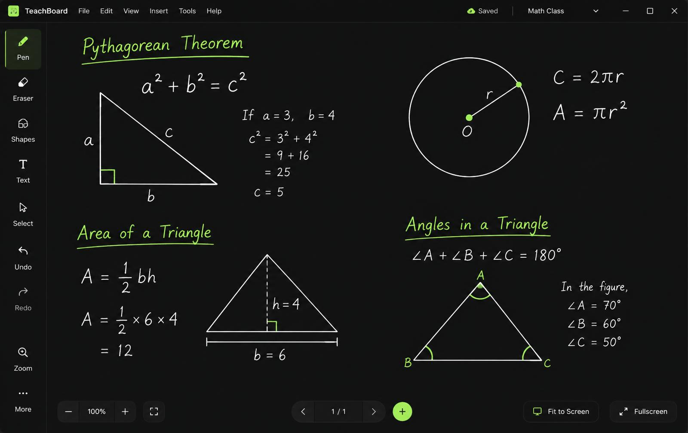
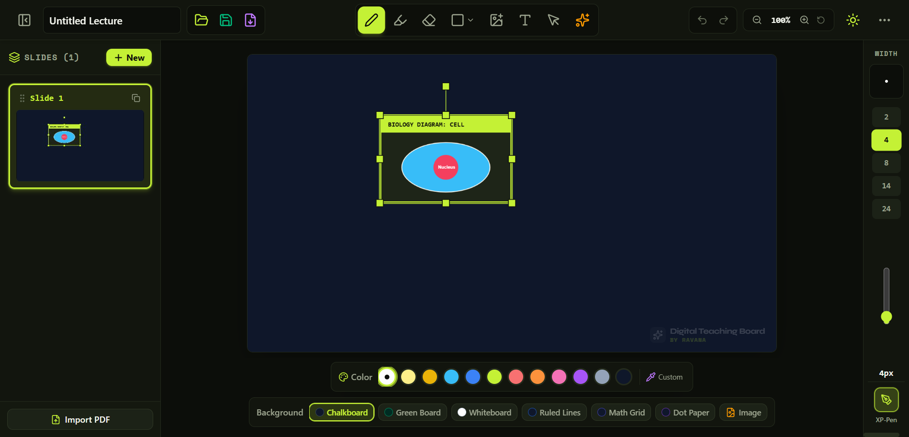
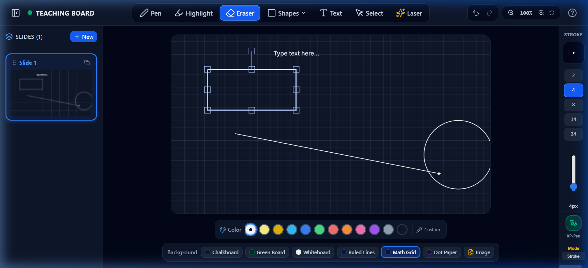
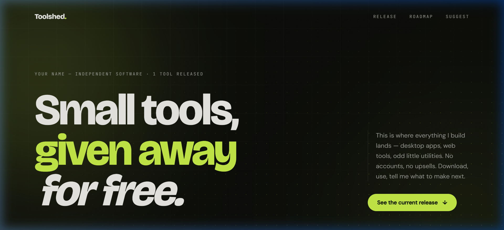

# 🎓 Digital Teaching Board

> **Aapki classroom aur online teaching ke liye ek modern, simple aur powerful digital whiteboard.**
>
> 🌐 **Official Website:** [https://toolshedd.netlify.app/](https://toolshedd.netlify.app/)  
> 📥 **Download Windows App:** [https://toolshedd.netlify.app/#release](https://toolshedd.netlify.app/#release)

Digital Teaching Board ko khas taur par teachers, educators aur content creators ke liye design kiya gaya hai. Chahe aap live online class le rahe hon, YouTube lecture record kar rahe hon, ya offline smartboard par padha rahe hon — ye app aapko ek ultra-smooth, clean aur distraction-free teaching experience deta hai.

---

---

## ✨ Khas Features (Features List)

### 🖊️ 1. Natural Drawing & Teaching Tools
- **Pressure-Sensitive Pen:** Stylus aur graphic tablet (XP-Pen, Wacom, Huion) ke sath bilkul real chalkboard chalk/pen jaisa feel hota hai.
- **Highlighter Tool:** Semi-transparent ink — kisi bhi text, handwritten note ya diagram ko highlight karein, peeche likha text bilkul clear dikhega.
- **Point Eraser:** Galti hone par natural tarike se stroke-by-stroke mitayein bina poora page clean kiye.
- **Shapes Tool:** Perfect Circle, Rectangle, Line aur Arrow ek drag mein banayein. Banne ke baad unhe select, move aur resize kar sakte hain.
- **Text Tool:** Canvas par kahin bhi click karke clean text type karein.
- **Image Tool:** Koi bhi question paper, diagram, chart ya photo direct canvas par insert karein aur resize/rotate karein.
- **Laser Pointer:** Live class mein students ka dhyan specific points par attract karne ke liye self-fading laser trail.

---

---

### 📄 2. Multiple Slides & Page Management
- Ek hi lecture ke andar multiple slides banayein (`Ctrl + N`).
- Thumbnail sidebar se kisi bhi slide par instant switch karein.
- Slides ko duplicate karein ya unhe reorder karein.

### 🎨 3. Six Teaching Backgrounds
- **Chalkboard:** Traditional dark slate blackboard — aankhon ke liye sabse comfortable.
- **Green Board:** Classic emerald school chalkboard feel.
- **Whiteboard:** Clean crisp white board.
- **Ruled Lines:** Hindi aur English cursive writing practice ke liye four-line/single-line notebook paper.
- **Math Grid:** Mathematics, geometry aur graph equations ke liye grid paper.
- **Dot Grid:** Diagrams aur engineering sketches ke liye dotted layout.

---

---

### 🖥️ 4. Fullscreen Zen Teaching Mode
- **`F` Key** dabate hi saare toolbars hide ho jaate hain aur aapko milta hai 100% full-screen distraction-free canvas.
- Teaching ke waqt students ko screen par koi unnecessary menus ya buttons nahi dikhte.

### 💾 5. Save, Load & PDF Export
- **Project Save (`Ctrl + S`):** Apna poora lecture `.board` file mein save karein aur agle din wahin se continue karein.
- **PDF Export:** Class khatam hone ke baad ek click mein poore lecture ke notes ko multi-page high quality PDF mein export karke students ko share karein.
- **PDF Import:** Kisi bhi existing PDF assignment ya presentation ko open karke uske upar live padhayein aur annotate karein.

### 🏷️ 6. Branding & Custom Watermark
- Canvas ke corner mein subtle custom watermark lagayein (Settings se kabhi bhi ON ya OFF kar sakte hain).

### 🌓 7. Dark / Light Theme
- Classroom lighting ke anusaar Dark Olive theme ya Crisp Light theme choose karein.

---

## 🌐 Official Website & Live Portal

Aap hamari official live website par jaakar app ka latest version download kar sakte hain, roadmap check kar sakte hain, aur naye features suggest kar sakte hain:

👉 **[https://toolshedd.netlify.app/](https://toolshedd.netlify.app/)**

---

## 🚀 Installation Guide (Kaise Install Karein)

App install karna behad aasan hai:

1. **Download:** Website par jaakar **[Download for Windows (.exe)](https://toolshedd.netlify.app/#release)** par click karein.
2. **Setup Run:** Download hui `Digital Teaching Board Setup 1.0.0.exe` file par double-click karein.
3. **Finish:** Installer automatically install karke desktop par app ka shortcut create kar dega.
4. **Start:** Desktop icon par click karein aur padhana shuru karein!

> **Note:** App 100% offline chalti hai — padhane ke liye internet, account ya login ki koi zaroorat nahi hai.

---

## 📖 Quick Start Guide (Kaise Use Karein)

1. **Board Par Likhna Shuru Karein:**
   - Top toolbar se **Pen** select karein ya keyboard par **`P`** dabayein.
   - Neeche diye color strip se apna pasandida color choose karein aur draw karein.

2. **Background Badlein:**
   - Top bar mein Background icon par click karein aur Chalkboard, Green board ya Math Grid select karein (`Ctrl + 1` to `Ctrl + 6`).

3. **Nayi Slide Add Karein:**
   - Sidebar mein **`+`** button par click karein ya keyboard par **`Ctrl + N`** dabayein.

4. **Shapes & Images Add Karein:**
   - **Shapes:** Shape icon (`S`) se Circle/Rectangle/Arrow chunein aur mouse/pen drag karke draw karein.
   - **Image:** Image icon (`I`) par click karein aur diagram select karein.

5. **Galti Sudharein (Undo/Redo):**
   - Agar kuch galat ho jaye to **`Ctrl + Z`** dabayein (Undo) ya **`Ctrl + Y`** dabayein (Redo).

6. **Zen Fullscreen Mode:**
   - Toolbars hide karne ke liye **`F`** dabayein. Wapas aane ke liye **`Esc`** dabayein.

7. **PDF Export Karein:**
   - Top bar mein **Export PDF** icon par click karein. Aapki saari slides ek sundar PDF document ban kar save ho jayengi.

---

## ⌨️ Keyboard Shortcuts Reference

Teaching ke dauran bina mouse touch kiye fast switch karne ke liye in shortcuts ka use karein:

| Category | Action | Shortcut Key |
| :--- | :--- | :--- |
| **Drawing Tools** | Pen Tool | `P` |
| | Highlighter Tool | `H` |
| | Point Eraser | `E` |
| | Shapes (Circle, Box, Arrow, Line) | `S` |
| | Insert Image | `I` |
| | Text Tool | `T` |
| | Select / Move / Resize | `V` |
| | Laser Pointer | `L` |
| | Delete Selected Object | `Delete` ya `Backspace` |
| **Quick Colors** | White / Yellow / Blue / Green / etc. | Keys `1` se `9` |
| **Backgrounds** | Chalkboard (Dark Slate) | `Ctrl + 1` |
| | Green Board (Emerald) | `Ctrl + 2` |
| | Whiteboard (Clean White) | `Ctrl + 3` |
| | Ruled Lines (Writing Practice) | `Ctrl + 4` |
| | Math Grid (Graph Paper) | `Ctrl + 5` |
| | Dot Grid (Sketches) | `Ctrl + 6` |
| **Screen & View** | Fullscreen Zen Mode (Hide Toolbars) | `F` |
| | Exit Zen Mode / Close Modals | `Esc` |
| | Window Fullscreen | `F11` |
| | Reset Zoom to 100% | `Ctrl + 0` |
| | Pan Canvas View | `Space + Mouse Drag` |
| **Slides** | Next Slide | `Right Arrow` ya `Page Down` |
| | Previous Slide | `Left Arrow` ya `Page Up` |
| | New Slide | `Ctrl + N` |
| | Duplicate Slide | `Ctrl + D` |
| **Project** | Undo | `Ctrl + Z` |
| | Redo | `Ctrl + Y` |
| | Save Project (.board) | `Ctrl + S` |
| | Open Shortcuts Help Guide | `?` |

---

## 💻 System Requirements

- **Operating System:** Windows 10 ya Windows 11 (64-bit)
- **Processor:** Intel Core i3 / AMD Ryzen 3 ya behtar
- **Memory (RAM):** Minimum 4 GB (8 GB recommended)
- **Storage:** 300 MB free space
- **Input Device:** Mouse, Touchscreen, ya Graphic Tablet (XP-Pen, Wacom, Huion, etc.)

---

## 👨‍🏫 About & Credits

- **Application Name:** Digital Teaching Board
- **Version:** 1.0.0 (Windows Desktop Release)
- **Created By:** Ravana
- **Website:** [https://toolshedd.netlify.app/](https://toolshedd.netlify.app/)
- **License:** Free for Teachers, Educators & Students

---

## 💬 Support & Feedback

Agar aapko app use karne mein koi pareshani aati hai, ya aap koi naya feature suggest karna chahte hain:
- **Suggestion Box:** Hamari website par jakar Suggestion Box mein apna idea bhejein:  
  👉 **[https://toolshedd.netlify.app/#suggest](https://toolshedd.netlify.app/#suggest)**
- **Contact:** [YOUR EMAIL]

---

*Happy Teaching! 🚀*
